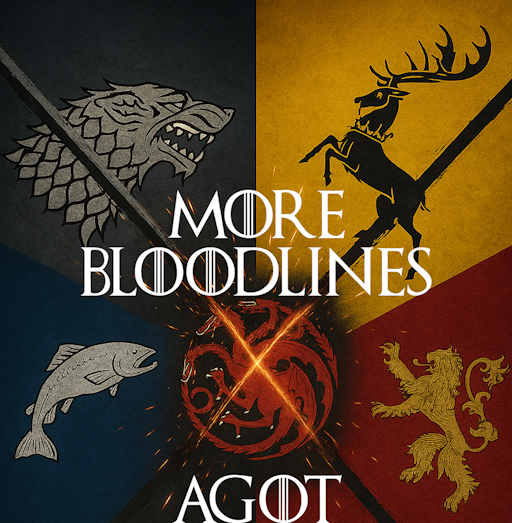

# More Bloodlines - CK3 AGOT submod

<div align="center">
  <a href="https://steamcommunity.com/sharedfiles/filedetails/?id=3525365211">
    
  </a>
</div>

A comprehensive submod for **A Game of Thrones (AGOT)** mod for **Crusader Kings III** that adds hundreds of new historical bloodlines to enhance your gameplay experience.

## Overview

This submod expands the bloodline system from ck2 in CK3 AGOT by adding unique hereditary traits representing the legacy of famous historical characters from the A Song of Ice and Fire universe. Each bloodline provides specific bonuses and reflects the achievements of legendary figures from Westeros and Essos.

## Features

### Extensive Bloodline Collection
- **200+ unique bloodlines** covering all major regions of the known world
- Bloodlines for legendary kings, warriors, builders, and other notable figures
- Both male and female character bloodlines included

### Regional Coverage
- **The North**: Stark bloodlines (Bran the Builder, Cregan Stark, Winged Wolf, etc.)
- **The Reach**: Gardener and Tyrell bloodlines (Greenhand, various Reach houses)
- **Dorne**: Martell and Dornish bloodlines (Nymeria, Meria Martell, Dayne bloodlines)
- **The Vale**: Arryn and mountain clan bloodlines
- **The Riverlands**: Tully, Blackwood, and other river lord bloodlines
- **The Westerlands**: Lannister and western house bloodlines
- **The Iron Islands**: Ironborn bloodlines and sea kings
- **The Stormlands**: Baratheon and stormlander bloodlines
- **The Crownlands**: Targaryen and Crownlands bloodlines
- **Essos**: Eastern bloodlines including Braavosi, Lysene, and Dothraki

### Gameplay Features
- **Customizable inheritance rules** via game rules
- **Dynamic bloodline assignment** based on game start dates
- **Balanced gameplay effects** - modest bonuses that enhance roleplay without breaking balance
- **Hidden traits** that don't clutter the character screen but provide meaningful effects

## Installation

1. [Subscribe to the mod on Steam Workshop (ID: 3525365211)](https://steamcommunity.com/sharedfiles/filedetails/?id=3525365211)
2. Ensure you have the **A Game of Thrones** mod installed and enabled
3. Enable **More Bloodlines** in your mod list
4. Start a new game to experience the full features

## Compatibility

- **CK3 Version**: 1.16.2.3
- **Required**: A Game of Thrones mod for CK3
- **Save Game Compatible**: Yes (for most features)

## Game Rules

The mod includes customizable game rules for bloodline inheritance:
- **All Descendants** (Default): All dynasty members inherit bloodlines
- **CK2 Version**: More restrictive inheritance similar to CK2 bloodlines
- **Real Father Version**: Bloodlines pass through biological lineage only

## Bloodline Categories

### Royal Bloodlines
Famous kings and queens who shaped history:
- Aegon the Conqueror
- Jaehaerys the Conciliator  
- Nymeria of the Rhoyne
- Bran the Builder
- And many more...

### Warrior Bloodlines
Legendary fighters and military leaders:
- Cregan Stark
- Daemon Blackfyre
- Ryam Redwyne
- Duncan the Tall
- And dozens more...

### Builder/Cultural Bloodlines
Those who left their mark through construction and culture:
- Bran the Builder
- Various Hightower bloodlines
- Scholarly and artistic bloodlines

## File Structure

```
common/
├── decision_group_types/   # Decision group definitions
├── decisions/              # Bloodline-related decisions
├── game_rules/            # Bloodline inheritance options
├── on_action/             # Dynamic bloodline assignment and compatibility
├── script_values/         # Scripted values for bloodline mechanics
├── scripted_effects/      # Scripted effects for bloodline operations
└── traits/                # Bloodline trait definitions

data_binding/              # Placeholder macros and data binding
events/                    # Bloodline-related events and activities
gui/                      # User interface elements and scripted widgets
gfx/                      # Bloodline icons and graphics
localization/             # Text and descriptions (English/Spanish)
```

## Contributing

This mod is actively maintained. If you encounter issues or have suggestions:
- Report bugs through Steam Workshop comments
- Suggest new bloodlines or improvements
- Check compatibility with other submods

## Credits

- **CK3 AGOT Team**: For the incredible base mod
- **George R.R. Martin**: For creating the rich world of A Song of Ice and Fire
- **Community**: For feedback and suggestions

## Version History

- **v0.0.1**: Initial release with 200+ bloodlines and dynamic inheritance system

## License

This mod is created for educational and entertainment purposes. All rights to A Song of Ice and Fire belong to George R.R. Martin.

---

*"A reader lives a thousand lives before he dies. The man who never reads lives only one."* - George R.R. Martin
